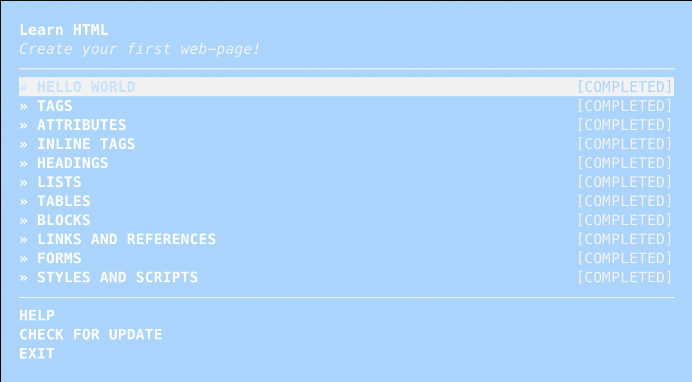
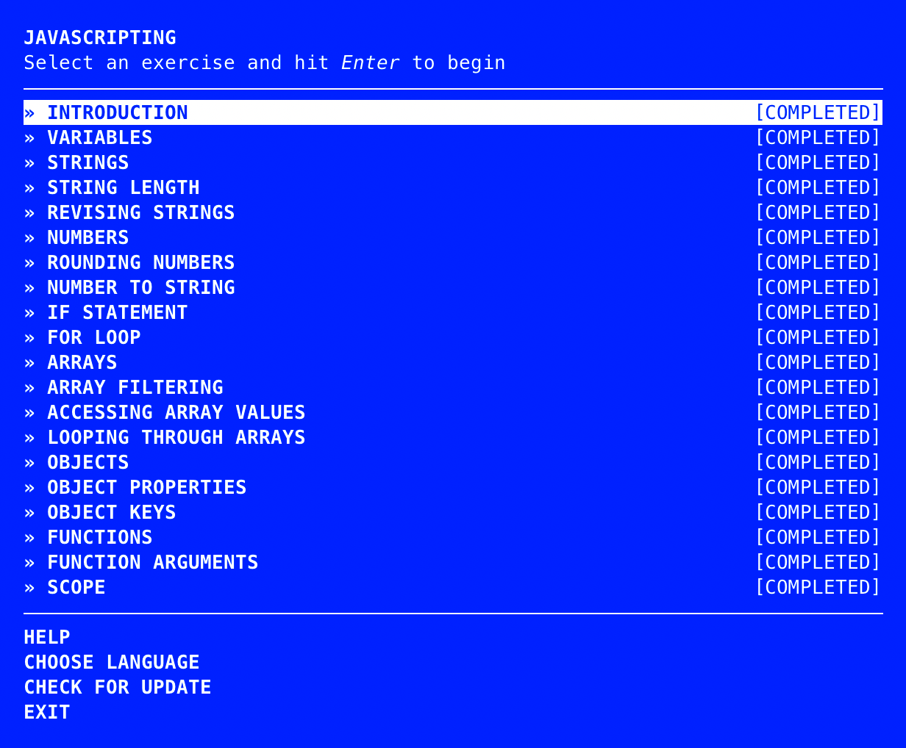
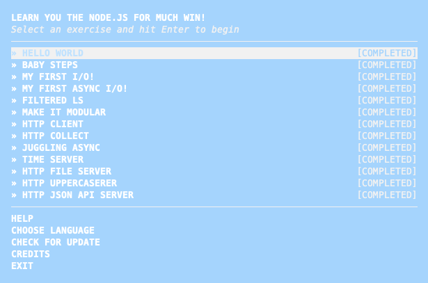

# Assignment 1 CS 533 F24
## Jim Ecker

### Files

* [html](html)

| Lesson               | File                 |
|----------------------|----------------------|
| Hello World          | [index.html](html/index.html)      |
| Tags                 | [tags.html](html/tags.html)       |
| Attributes           | [attributes.html](html/attributes.html) |
| Inline Tags          | [inline.html](html/inline.html)     |
| Headings             | [headings.html](html/headings.html)   |
| Lists                | [lists.html](html/lists.html)      |
| Tables               | [tables.html](html/tables.html)     |
| Blocks               | [blocks.html](html/blocks.html)     |
| Links and References | [links.html](html/links.html)      |
| Forms                | [forms.html](html/forms.html)      |
| Styles and Scripts   | [styles.html](html/styles.html)     |

* [javascript](javascript)

| Lesson                 | File                                                              |
|------------------------|-------------------------------------------------------------------|
| Introduction           | [introduction.js](javascript/introduction.js)                     |
| Variables              | [variables.js](javascript/variables.js)                           |
| Strings                | [strings.js](javascript/strings.js)                               |
| String Length          | [string-length.js](javascript/string-length.js)                   |
| Revising Strings       | [revising-strings.js](javascript/revising-strings.js)             |
| Numbers                | [numbers.js](javascript/numbers.js)                               |
| Rounding Numbers       | [rounding-numbers.js](javascript/rounding-numbers.js)             |
| Number to String       | [number-to-string.js](javascript/number-to-string.js)             |
| If Statement           | [if-statement.js](javascript/if-statement.js)                     |
| For Loop               | [for-loop.js](javascript/for-loop.js)                             |
| Arrays                 | [arrays.js](javascript/arrays.js)                                 |
| Array Filtering        | [array-filtering.js](javascript/array-filtering.js)               |
| Accessing Array Values | [accessing-array-values.js](javascript/accessing-array-values.js) |
| Looping Through Arrays | [looping-through-arrays.js](javascript/looping-through-arrays.js) |
| Objects                | [objects.js](javascript/objects.js)                               |
| Object Properties      | [object-properties.js](javascript/object-properties.js)           |
| Object Keys            | [object-keys.js](javascript/object-keys.js)                       |
| Functions              | [functions.js](javascript/functions.js)                           |
| Function Arguments     | [function-arguments.js](javascript/function-arguments.js)         |
| Scope                  | [scope.js](javascript/scope.js)                                   |

* [node](node)

| Lesson               | File                                                    |
|----------------------|---------------------------------------------------------|
| Hello World          | [hello-world.js](node/hello-world.js)                   |
| Baby Steps           | [baby-steps.js](node/baby-steps.js)                     |
| My First I/O!        | [my-first-io.js](node/my-first-io.js)                   |
| My First Async I/O!  | [my-first-async-io.js](node/my-first-async-io.js)       |
| Filtered LS          | [filtered-ls.js](node/filtered-ls.js)                   |
| Make It Modular      | [make-it-modular.js](node/make-it-modular.js)           |
| HTTP Client          | [http-client.js](node/http-client.js)                   |
| HTTP Collect         | [http-collect.js](node/http-collect.js)                 |
| Juggling Async       | [juggling-async.js](node/juggling-async.js)             |
| Time Server          | [time-server.js](node/time-server.js)                   |
| HTTP File Server     | [http-file-server.js](node/http-file-server.js)         |
| HTTP Uppercaserer    | [http-uppercaserer.js](node/http-uppercaserer.js)       |
| HTTP JSON API Server | [http-json-api-server.js](node/http-json-api-server.js) |

### Completion Screens

### Youtube Link

The video of the files and test completion pages is available at https://youtu.be/vXnyvEJgS6U