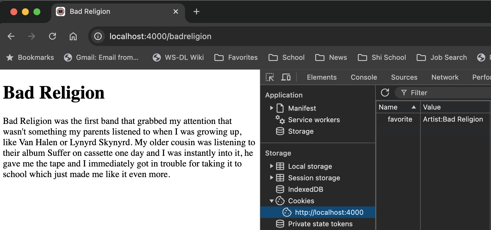
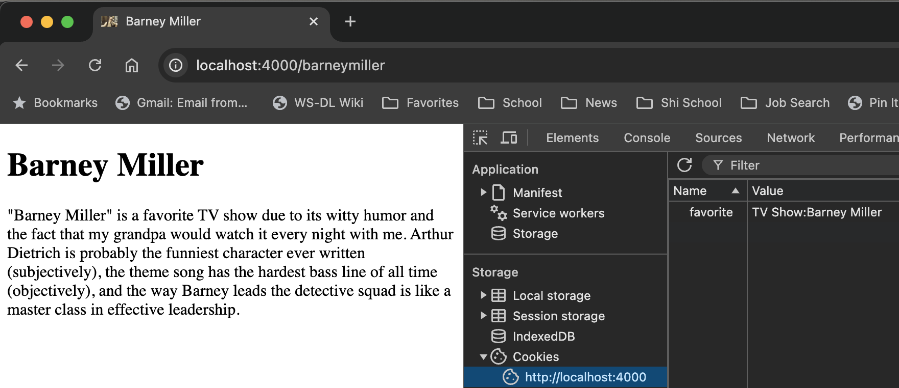
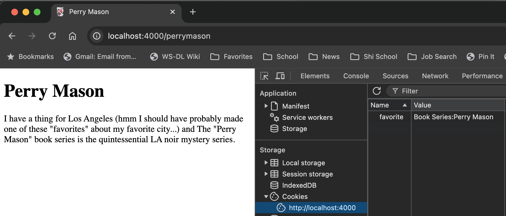
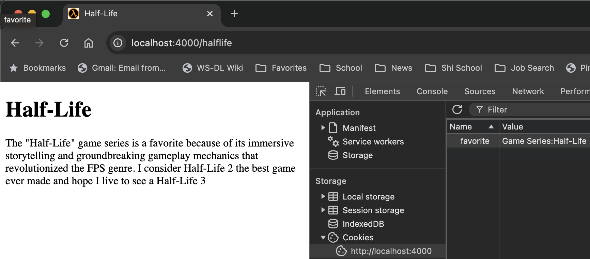

# Assignment 2 CS 533 F24
## Jim Ecker

This repository contains all of the code developed while completing assignment 2

## Youtube Link

The video demo is available at https://youtu.be/Y3RZsPSoEUY


## Table of Contents
- [Implementation Requirements](#implementation-requirements)
  - [Set up a server](#set-up-a-server)
  - [Extra credit](#extra-credit)
- [Pages with Cookies and Favicon](#pages-with-cookies-and-favicon)
- [File Structure](#file-structure)
- [server.js](#serverjs)
- [Dynamic Route Generation and Cookie Setting](#dynamic-route-generation-and-cookie-setting)
  - [Overview](#overview)
  - [How Routes Are Dynamically Built](#how-routes-are-dynamically-built)
    - [Step-by-Step Process](#step-by-step-process)
  - [Route Paths, Access URLs, and Cookie Values](#route-paths-access-urls-and-cookie-values)
- [Usage](#usage)
  - [Run the server](#run-the-server)
  - [Access a served route](#access-a-served-route)
- [HTML files](#html-files)
  - [pages/artist/bad-religion.html](#pagesartistbad-religionhtml)
  - [pages/book-series/perry-mason.html](#pagesbook-seriesperry-masonhtml)
  - [pages/game-series/half--life.html](#pagesgame-serieshalf--lifehtml)
  - [pages/tv-show/barney-miller.html](#pagestv-showbarney-millerhtml)
- [Favicons](#favicons)

### Implementation Requirements

#### Set up a server 

* Set up and run a server on your local machine
* Install four "paths" on your server, with each path corresponding to a favorite artist, musician, film, or TV series.  For example, my paths might be:
   * localhost:4000/djshadow
   * localhost:4000/game-of-thrones.html
   * localhost:4000/silo.html
   * localhost:4000/Ozark
* For each path, have a sentence or two in HTML that explains why this is a favorite of yours
* For each path, set a cookie that echos the corresponding favorite of yours (make up a syntax for your key-value pair, but keep the cookies human-readable)

* #### Extra credit

    * install and demonstrate a favicon.ico for your site

## Pages with Cookies and Favicon






## File Structure

```cpp
assignments/Ecker/2/
├── server.js
├── images/
│   └── br-render.png
│   └── bm-render.png
│   └── pm-render.png
│   └── hl-render.png
├── favicons/
│       ├── br
│       │   └── android-chrome-192x192.png
│       │   └── android-chrome-512x512.png
│       │   └── apple-touch-icon.png
│       │   └── browserconfig.xml
│       │   └── favicon-16x16.png
│       │   └── favicon-32x32.png
│       │   └── favicon.ico
│       │   └── mstile-150x150.png
│       │   └── site.webmanifest
│       ├── bm
│       │   └── android-chrome-192x192.png
│       │   └── android-chrome-512x512.png
│       │   └── apple-touch-icon.png
│       │   └── browserconfig.xml
│       │   └── favicon-16x16.png
│       │   └── favicon-32x32.png
│       │   └── favicon.ico
│       │   └── mstile-150x150.png
│       │   └── site.webmanifest
│       ├── pm
│       │   └── android-chrome-192x192.png
│       │   └── android-chrome-512x512.png
│       │   └── apple-touch-icon.png
│       │   └── browserconfig.xml
│       │   └── favicon-16x16.png
│       │   └── favicon-32x32.png
│       │   └── favicon.ico
│       │   └── mstile-150x150.png
│       │   └── site.webmanifest
│       ├── hl
│       │   └── android-chrome-192x192.png
│       │   └── android-chrome-512x512.png
│       │   └── apple-touch-icon.png
│       │   └── browserconfig.xml
│       │   └── favicon-16x16.png
│       │   └── favicon-32x32.png
│       │   └── favicon.ico
│       │   └── mstile-150x150.png
│       │   └── site.webmanifest
└── pages/
    ├── artist/
    │   └── bad-religion.html
    ├── tv-show/
    │   └── barney-miller.html
    ├── book-series/
    │   └── perry-mason.html
    ├── game-series/
    │   └── half--life.html
```

## server.js

```js
const express = require('express');
const cookieParser = require('cookie-parser');
const path = require('path');
const fs = require('fs');
const app = express();
const port = 4000;

/* 
List of acronyms to be fully capitalized
  There does not appear to be a good option to reliably capitalize abbreviations and acronyms
  from the NPM
  
  I tried both title-case and ap-style-title-case packages and neither correctly capitalized "TV"
  This is my solution for now - using a list of common abbreviations and checking against it. I would
  like a more robust solution but for this project this will suffice.

  - Jim
*/
const ACRONYMS = new Set([
  'TV', 'USA', 'UK', 'NASA', 'FBI', 'CIA', 'HTML', 'CSS', 'JSON', 'ID', 'CPU', 'RAM',
  'API', 'HTTP', 'HTTPS', 'SQL', 'XML', 'WWW', 'URL', 'URI', 'TCP', 'UDP', 'IP',
  'DNS', 'GUI', 'SDK', 'JPEG', 'PNG', 'GIF', 'PDF', 'UN', 'EU', 'GPS', 'AI', 'VR',
  'AR', 'IOT', 'SMTP', 'FTP', 'SSH', 'REST', 'SOAP', 'JWT', 'USB', 'GPU', 'ATM',
  'LED', 'LCD', 'CD', 'DVD', 'HD', 'SSD', 'BIOS', 'OS', 'PC', 'IT', 'HR', 'CEO',
  'CFO', 'COO', 'CTO', 'VPN', 'LAN', 'WAN', 'PIN', 'DOB', 'ASAP', 'ETA', 'FYI',
  'DIY', 'BRB', 'LOL', 'OMG', 'BTW', 'IDK', 'IMHO', 'IRL', 'JK', 'N/A', 'R&D'
]);

app.use(cookieParser());

// Set Cookie
const setCookie = (type, name) => (request, response, next) => {
    response.cookie('favorite', `${type}:${name}`, {
        maxAge: 900000,
        httpOnly: false,
        encode: String,
    });
    next();  
};

app.use(express.static('pages'));
app.use(express.static('favicons'));

// Function to convert a string to title case with acronym handling
function toTitleCase(str) {
  return str.replace(/\b\w+\b/g, function (word) {
    if (ACRONYMS.has(word.toUpperCase())) {
      return word.toUpperCase();
    } else {
      return word.charAt(0).toUpperCase() + word.substr(1).toLowerCase();
    }
  });
}

// Function to handle double dashes and convert to title case
function handleDoubleDashes(str) {
  // Temporarily replace '--' with a null character
  str = str.replace(/--/g, '\0');
  // Replace single dashes with spaces
  str = str.replace(/-/g, ' ');
  // Restore '--' (null character) back to '-'
  str = str.replace(/\0/g, '-');
  // Convert to title case
  return toTitleCase(str);
  }

// Function to recursively read files from a directory
function readFilesRecursively(dir, callback) {
  fs.readdirSync(dir).forEach((fileOrDir) => {
    const fullPath = path.join(dir, fileOrDir);
    const stat = fs.statSync(fullPath);

    if (stat.isDirectory()) {
      // If it's a directory, recurse into it
      readFilesRecursively(fullPath, callback);
    } else if (stat.isFile() && path.extname(fullPath) === '.html') {
      // If it's an HTML file, execute the callback
      callback(fullPath);
    }
  });
}

// Function to build routes dynamically
function buildRoutes() {
  const pagesDir = path.join(__dirname, 'pages');

  readFilesRecursively(pagesDir, (filePath) => {
    // Extract 'type' and 'name' from the file path
    const relativePath = path.relative(pagesDir, filePath);
    const pathSegments = relativePath.split(path.sep);

    if (pathSegments.length !== 2) {
      console.warn(
        `File "${filePath}" is not in the expected 'Type/Name.html' format. Skipping.`
      );
      return;
    }

    let type = pathSegments[0];
    let nameWithExt = pathSegments[1];
    let name = path.basename(nameWithExt, '.html');

    // Handle double dashes for 'type' and 'name'
    type = toTitleCase(handleDoubleDashes(type));
    name = toTitleCase(handleDoubleDashes(name));

    // Build the route path by removing all dashes and converting to lowercase
    const routePath = '/' + nameWithExt.replace('.html', '').replace(/-/g, '').toLowerCase();

    // Build the file path correctly (directories and filenames are in lowercase)
    const typeDir = type.toLowerCase().replace(/ /g, '-').replace(/-/g, '-');
    const fileName = nameWithExt;

    // Create route dynamically
    app.get(routePath, setCookie(type, name), (req, res) => {
      res.sendFile(path.join(__dirname, 'pages', typeDir, fileName));
    });

    console.log(`Route created: ${routePath}`);
  });
}

// Build routes
buildRoutes();

// Run Server
app.listen(port, () => {
    console.log(`Server running at http://localhost:${port}/`);
});
```

### Dynamic Route Generation and Cookie Setting

This section explains how the server dynamically builds routes and sets cookies based on the file structure in the `pages/` directory.

#### Overview

- **Dynamic Routes**: The server scans the `pages/` directory to find all HTML files and generates routes based on their filenames and directory paths.
- **Cookie Setting**: When a user visits a dynamically generated route, the server sets a `favorite` cookie containing the type and name of the favorite item.

#### How Routes Are Dynamically Built

The server uses a function called `buildRoutes` to dynamically create routes based on the files found in the `pages/` directory.

##### Step-by-Step Process

1. **Reading the Directory Structure**

   The server recursively reads through the `pages/` directory to find all HTML files.

   ```javascript
   function readFilesRecursively(dir, callback) {
     fs.readdirSync(dir).forEach((fileOrDir) => {
       const fullPath = path.join(dir, fileOrDir);
       const stat = fs.statSync(fullPath);

       if (stat.isDirectory()) {
         // If it's a directory, recurse into it
         readFilesRecursively(fullPath, callback);
       } else if (stat.isFile() && path.extname(fullPath) === '.html') {
         // If it's an HTML file, execute the callback
         callback(fullPath);
       }
     });
   }

2. **Extracting Type and Name**

    For each HTML file found, the server extracts the `type` (category) and `name` (item name) based on the file's path.

    ```js
    const relativePath = path.relative(pagesDir, filePath);
    const pathSegments = relativePath.split(path.sep);

    if (pathSegments.length !== 2) {
    console.warn(`File "${filePath}" is not in the expected 'Type/Name.html' format. Skipping.`);
    return;
    }

    let type = pathSegments[0];
    let nameWithExt = pathSegments[1];
    let name = path.basename(nameWithExt, '.html');
    ```

    * `type` is extracted by reading the directory the html file is in (e.g. path: artist/bad-religion.html) is parsed as `type:artist`
     * `name` is extracted by reading the html filename itself a(e.g. path artist/bad-religion.html) is parsed as `name:bad-religion`

3. **Handling names that include dashes (e.g., "Half-Life")**

    The code uses dashes (-) in the html file name to signify a space between words. However, some names include a dash between words. We use a naming convention of using double dashes (--) to signify that we want to use a dash instead of a space.

    ### function handleDoubleDashes(str)
    ```js
    // Function to handle double dashes and convert to title case
    function handleDoubleDashes(str) {
      // Temporarily replace '--' with a null character
      str = str.replace(/--/g, '\0');
      // Replace single dashes with spaces
      str = str.replace(/-/g, ' ');
      // Restore '--' (null character) back to '-'
      str = str.replace(/\0/g, '-');
      // Convert to title case
      return toTitleCase(str);
    }
    ```

    We call this function for each `type` and `name`

    ```js
    // Handle double dashes for 'type' and 'name'
    type = toTitleCase(handleDoubleDashes(type));
    name = toTitleCase(handleDoubleDashes(name));
    ```
    * `type:game-series` becomes `type:Game Series`
    * `name:half--life` becomes `name:Half-Life`
    
4. **Building the Route Path**

    The route path is constructed by removing all dashes from the `name` and then converting it to lower case

    ```js 
    const routePath = '/' + nameWithExt.replace('.html', '').replace(/-/g, '').toLowerCase();
    ```

    * For example, `bad-religion.html` becomes `/badreligion`
    * `half--life.html` becomes `/halflife`

5. **Creating Routes**

    The server creates an Express route for each page

    ```js
    app.get(routePath, setCookie(type, name), (req, res) => {
        res.sendFile(path.join(__dirname, 'pages', typeDir, fileName));
    });
    ```

    * `setCookie(type, name)` is middleware that sets the `favorite` cookie
    
    ### How Cookies are set

    When a user visits a dynamically generated route, the server sets a `favorite` cookie containing the type and name of the favorite item.

    **Cookie Middleware**

    The `setCookie` middleware function is responsible for setting the cookie.

    ```js
    const setCookie = (type, name) => (req, res, next) => {
    res.cookie('favorite', `${type}: ${name}`, {
        maxAge: 900000, // Cookie expiration time in milliseconds
        httpOnly: false,
        encode: String, // Prevent encoding to keep spaces and special characters
    });
    next();
    };
    ```

    * The cookie value is formatted as `Type: Name`, e.g., `Game Series: Half-Life`.
    * `maxAge` sets how long the cookie will persist (900,000 milliseconds = 15 minutes).
    * `encode: String` prevents Express from URL-encoding the cookie value, which preserves whitespace for human readibility.


### Route Paths, Access URLs, and Cookie Values

| Original Path              | Type        | Name           | Filename             | Route Path     | Access URL                               | Cookie Key:Value                      |
|--------------------------------|-------------|----------------|----------------------|----------------|------------------------------------------|---------------------------------------|
| `artist/bad-religion.html`     | Artist      | Bad Religion   | `bad-religion.html`  | `/badreligion` | [http://localhost:4000/badreligion](http://localhost:4000/badreligion) | `favorite`: `Artist: Bad Religion`     |
| `tv-show/barney-miller.html`   | TV Show     | Barney Miller  | `barney-miller.html` | `/barneymiller`| [http://localhost:4000/barneymiller](http://localhost:4000/barneymiller) | `favorite`: `Tv Show: Barney Miller`   |
| `book-series/perry-mason.html` | Book Series | Perry Mason    | `perry-mason.html`   | `/perrymason`  | [http://localhost:4000/perrymason](http://localhost:4000/perrymason) | `favorite`: `Book Series: Perry Mason` |
| `game-series/half--life.html`  | Game Series | Half-Life      | `half--life.html`    | `/halflife`    | [http://localhost:4000/halflife](http://localhost:4000/halflife) | `favorite`: `Game Series: Half-Life`   |

* `Original Path` is (relative to `pages/` directory)
* The cookie key is `favorite`.
* The cookie value is constructed as `Type: Name`, with both `type` and `name` in title case.
* The `cookieParser::setCookie` middleware in the server.js file handles setting this cookie when a page is accessed.

### Usage

#### Run the server
```zsh
> node server.js
Route created: /badreligion
Route created: /perrymason
Route created: /halflife
Route created: /barneymiller
Server running at http://localhost:4000/
```

#### Access a served route

Make an http request to http://localhost:4000{`route`}

e.g. route `/halflife`: [http://localhost:4000/halflife](http://localhost:4000/halflife):

- The server serves the `half--life.html` page located at `pages/game-series/half--life.html`.
- The `favorite` cookie is set to `Game Series: Half-Life`.

## HTML files

All HTML files are stored in `pages/` in the subdirectory corresponding to its respective `favorite` `type`

* This gives us categorization for each item
    * `artist/`  -> `Artist`
    * `tv-show/` -> `TV Show`
    * `game-series/` -> `Game Series`
    * `book-series/` -> `Book Series`

### pages/artist/bad-religion.html

```html
<!DOCTYPE html>
<html>
  <head>
    <title>Bad Religion</title>
    <link rel="apple-touch-icon" sizes="180x180" href="/br/apple-touch-icon.png">
    <link rel="icon" type="image/png" sizes="32x32" href="/br/favicon-32x32.png">
    <link rel="icon" type="image/png" sizes="16x16" href="/br/favicon-16x16.png">
    <link rel="manifest" href="/br/site.webmanifest">
    <meta name="msapplication-TileColor" content="#da532c">
    <meta name="theme-color" content="#ffffff">
  </head>
  <body>
    <h1>Bad Religion</h1>
    <p>
      Bad Religion was the first band that grabbed my attention that wasn't something my parents listened to when I was growing up, like Van Halen or Lynyrd Skynyrd. My older cousin was listening to their album Suffer on cassette one day and I was instantly into it, he gave me the tape and I immediately got in trouble for taking it to school which just made me like it even more.
    </p>
  </body>
</html>
```

### pages/book-series/perry-mason.html

```html
<!DOCTYPE html>
<html>
  <head>
    <title>Perry Mason</title>
    <link rel="apple-touch-icon" sizes="180x180" href="/pm/apple-touch-icon.png">
    <link rel="icon" type="image/png" sizes="32x32" href="/pm/favicon-32x32.png">
    <link rel="icon" type="image/png" sizes="16x16" href="/pm/favicon-16x16.png">
    <link rel="manifest" href="/pm/site.webmanifest">
    <meta name="msapplication-TileColor" content="#da532c">
    <meta name="theme-color" content="#ffffff">
  </head>
  <body>
    <h1>Perry Mason</h1>
    <p>
      I have a thing for Los Angeles (hmm I should have probably made one of these "favorites" about my favorite city...) and The "Perry Mason" book series is the quintessential LA noir mystery series.
    </p>
  </body>
</html>
```

### pages/game-series/half--life.html

```html
<!DOCTYPE html>
<html>
  <head>
    <title>Half-Life</title>
    <link rel="apple-touch-icon" sizes="180x180" href="/hl/apple-touch-icon.png">
    <link rel="icon" type="image/png" sizes="32x32" href="/hl/favicon-32x32.png">
    <link rel="icon" type="image/png" sizes="16x16" href="/hl/favicon-16x16.png">
    <link rel="manifest" href="/hl/site.webmanifest">
    <meta name="msapplication-TileColor" content="#da532c">
    <meta name="theme-color" content="#ffffff">
  </head>
  <body>
    <h1>Half-Life</h1>
    <p>
      The "Half-Life" game series is a favorite because of its immersive storytelling and groundbreaking gameplay mechanics that revolutionized the FPS genre. I consider Half-Life 2 the best game ever made and hope I live to see a Half-Life 3
    </p>
  </body>
</html>
```

### pages/tv-show/barney-miller.html

```html
<!DOCTYPE html>
<html>
  <head>
    <title>Barney Miller</title>
    <link rel="apple-touch-icon" sizes="180x180" href="/bm/apple-touch-icon.png">
    <link rel="icon" type="image/png" sizes="32x32" href="/bm/favicon-32x32.png">
    <link rel="icon" type="image/png" sizes="16x16" href="/bm/favicon-16x16.png">
    <link rel="manifest" href="/bm/site.webmanifest">
    <meta name="msapplication-TileColor" content="#da532c">
    <meta name="theme-color" content="#ffffff">
  </head>
  <body>
    <h1>Barney Miller</h1>
    <p>
      "Barney Miller" is a favorite TV show due to its witty humor and the fact that my grandpa would watch it every night with me. Arthur Dietrich is probably the funniest character ever written (subjectively), the theme song has the hardest bass line of all time (objectively), and the way Barney leads the detective squad is like a master class in effective leadership.
    </p>
  </body>
</html>
```

## Favicons
Favicons for each page are stored in the `favicons/` directory, in its respective subdirectory

| html page path                     | favicon path | image
|------------------------------------|--------------|------|
| pages/artist/bad-religion.html     | favicons/br/  |  |
| pages/book-series/perry-mason.html | favicons/pm/  |  | |
| pages/game-series/half--life.html  | favicons/hl/  |  | |
| pages/tv-show/barney-miller.html   | favicons/bm/  |  | |

Each favicon subdirectory holds files needed by various browsers to render its favicon

```
android-chrome-192x192.png
android-chrome-512x512.png
apple-touch-icon.png
browserconfig.xml
favicon-16x16.png
favicon-32x32.png
favicon.ico
mstile-150x150.png
site.webmanifest
```

