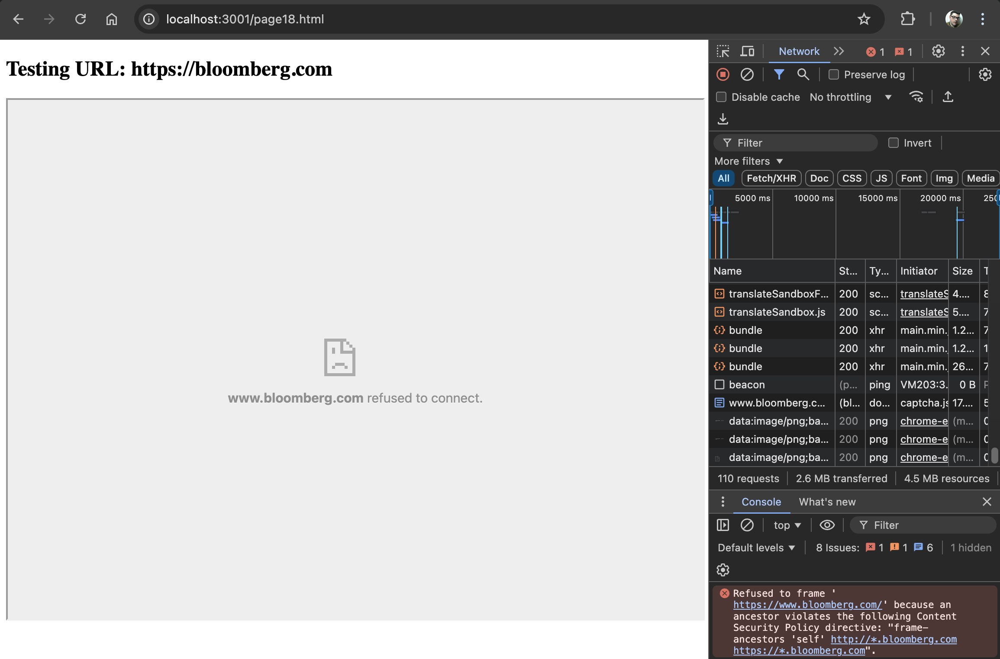

# Assignment 4 - Framability Auditing and Frame Path Attacks

This repo contains code and documentation for CS533F24 Assignment 4


[Video demo for the framability auditing - Youtube](https://youtu.be/CSRzD5MLef8)

[Video demo for the Frame Path Attack - Youtube](https://youtu.be/miL9tkkbSIE)

# Table of Contents

- [Framable Sites Report](#framable-sites-report)
- [Iframe Audit Server](#iframe-audit-server)
  - [How It Works](#how-it-works)
  - [Prerequisites](#prerequisites)
  - [Setup](#setup)
  - [Usage](#usage)
  - [Directory Structure](#directory-structure)
  - [Code Explanation](#code-explanation)
  - [Example `index.html` Structure](#example-indexhtml-structure)
  - [Iframe Test Page - Example](#iframe-test-page---example)
  - [Notes](#notes)
  - [Troubleshooting](#troubleshooting)
- [Automating the Framability Audit with `checkFramable.py`](#automating-the-framability-audit-with-checkframablepy)
  - [How It Works](#how-it-works-1)
  - [Prerequisites](#prerequisites-1)
  - [Setup](#setup-1)
  - [Usage](#usage-1)
  - [Example Report](#example-report)
  - [Code Explanation](#code-explanation-1)
  - [Troubleshooting](#troubleshooting-1)
- [Frame Path Attack Demo](#frame-path-attack-demo)
  - [How It Works](#how-it-works-2)
  - [Prerequisites](#prerequisites-2)
  - [Setup](#setup-2)
  - [Usage](#usage-2)
  - [Code Explanation](#code-explanation-2)
  - [Example `parent.html`](#example-parenthtml)
  - [Example `iframe.html`](#example-iframehtml)
- [Extra Credit](#extra-credit)
  - [Iframe Bypass Audit Report](#iframe-bypass-audit-report)
  - [Iframe Bypass Proxy Server](#iframe-bypass-proxy-server)
    - [Prerequisites](#prerequisites-3)
    - [How to Run the Server](#how-to-run-the-server)
- [The Rime of the Ancient Mariner Reference](#the-rime-of-the-ancient-mariner-reference)

# Framable Sites Report

| Page | URL | Framable | Reason |
|------|-----|----------|--------|
| 1 | https://000webhost.com | No | X-Frame-Options: sameorigin |
| 2 | https://4shared.com | Yes |  |
| 3 | https://abcnews.go.com | Yes |  |
| 4 | https://about.com | No | X-Frame-Options: sameorigin |
| 5 | https://accounts.google.com | No | X-Frame-Options: deny |
| 6 | https://alexa.com | Yes |  |
| 7 | https://amazon.co.uk | No | X-Frame-Options: sameorigin |
| 8 | https://amazon.es | No | X-Frame-Options: sameorigin |
| 9 | https://amazon.fr | No | X-Frame-Options: sameorigin |
| 10 | https://www.amebaownd.com | No | X-Frame-Options: sameorigin |
| 11 | https://android.com | Yes |  |
| 12 | https://apache.org | No | Content-Security-Policy: frame-ancestors 'none' |
| 13 | https://bandcamp.com | Yes |  |
| 14 | https://bbc.co.uk | No | X-Frame-Options: deny |
| 15 | https://berkeley.edu | No | X-Frame-Options: sameorigin |
| 16 | https://bigcommerce.com | No | X-Frame-Options: sameorigin |
| 17 | https://bloglovin.com | No | X-Frame-Options: sameorigin |
| 18 | https://bloomberg.com | No | Content-Security-Policy: frame-ancestors 'self' http://*.bloomberg.com https://*.bloomberg.com, upgrade-insecure-requests |
| 19 | https://booking.com | Yes |  |
| 20 | https://box.com | No | X-Frame-Options: sameorigin |
| 21 | https://bp0.blogger.com | Yes |  |
| 22 | https://www.clickbank.net | No | X-Frame-Options: sameorigin |
| 23 | https://cloudflare.com | No | X-Frame-Options: sameorigin |
| 24 | https://deezer.com | No | X-Frame-Options: sameorigin |
| 25 | https://doi.org | Yes |  |
| 26 | https://domainmarket.com | No | X-Frame-Options: sameorigin |
| 27 | https://e-monsite.com | No | X-Frame-Options: sameorigin |
| 28 | https://enable-javascript.com | Yes |  |
| 29 | https://europa.eu | No | X-Frame-Options: sameorigin |
| 30 | https://eventbrite.com | Yes |  |
| 31 | https://fb.me | No | X-Frame-Options: deny |
| 32 | https://focus.de | Yes |  |
| 33 | https://forms.gle | Yes |  |
| 34 | https://ft.com | No | Content-Security-Policy: frame-ancestors https://*.ft.com https://*.chromatic.com |
| 35 | https://ftc.gov | No | X-Frame-Options: sameorigin |
| 36 | https://gettyimages.com | No | X-Frame-Options: sameorigin |
| 37 | https://ggpht.com | Unknown | Cannot resolve domain: ggpht.com |
| 38 | https://gmail.com | No | X-Frame-Options: deny |
| 39 | https://godaddy.com | No | X-Frame-Options: deny |
| 40 | https://gofundme.com | Yes |  |
| 41 | https://google.co.uk | No | X-Frame-Options: sameorigin |
| 42 | https://google.pl | No | X-Frame-Options: sameorigin |
| 43 | https://groups.google.com | No | X-Frame-Options: deny |
| 44 | https://gstatic.com | Yes |  |
| 45 | https://guardian.co.uk | No | X-Frame-Options: sameorigin |
| 46 | https://ig.com.br | Yes |  |
| 47 | https://imdb.com | No | X-Frame-Options: sameorigin |
| 48 | https://independent.co.uk | No | X-Frame-Options: sameorigin |
| 49 | https://ja.wikipedia.org | Yes |  |
| 50 | https://jhu.edu | No | X-Frame-Options: sameorigin, sameorigin |
| 51 | https://jstor.org | No | X-Frame-Options: deny |
| 52 | https://justice.gov | No | X-Frame-Options: sameorigin |
| 53 | https://last.fm | No | X-Frame-Options: deny |
| 54 | https://lavanguardia.com | No | X-Frame-Options: sameorigin |
| 55 | https://linktr.ee | No | X-Frame-Options: deny |
| 56 | https://mail.ru | No | X-Frame-Options: sameorigin |
| 57 | https://merriam-webster.com | Yes |  |
| 58 | https://myaccount.google.com | No | X-Frame-Options: deny |
| 59 | https://myspace.com | No | X-Frame-Options: sameorigin |
| 60 | https://namecheap.com | No | X-Frame-Options: sameorigin |
| 61 | https://naver.com | No | X-Frame-Options: deny |
| 62 | https://netflix.com | No | X-Frame-Options: deny |
| 63 | https://netvibes.com | No | X-Frame-Options: deny |
| 64 | https://news.google.com | No | X-Frame-Options: sameorigin |
| 65 | https://nginx.com | No | X-Frame-Options: sameorigin |
| 66 | https://www.nih.gov | No | X-Frame-Options: sameorigin |
| 67 | https://opera.com | No | X-Frame-Options: sameorigin |
| 68 | https://photobucket.com | Yes |  |
| 69 | https://photos1.blogger.com | Yes |  |
| 70 | https://plus.google.com | No | X-Frame-Options: sameorigin |
| 71 | https://prezi.com | No | X-Frame-Options: deny |
| 72 | https://public-api.wordpress.com | No | X-Frame-Options: sameorigin |
| 73 | https://redbull.com | No | X-Frame-Options: sameorigin |
| 74 | https://sedoparking.com | Yes |  |
| 75 | https://softonic.com | Yes |  |
| 76 | https://spiegel.de | No | Content-Security-Policy: frame-ancestors 'self' |
| 77 | https://ssl-images-amazon.com | Unknown | Cannot resolve domain: ssl-images-amazon.com |
| 78 | https://stanford.edu | No | X-Frame-Options: sameorigin |
| 79 | https://steampowered.com | No | X-Frame-Options: deny |
| 80 | https://t-online.de | No | Content-Security-Policy: frame-ancestors 'self' https://*.t-online.de |
| 81 | https://techcrunch.com | No | X-Frame-Options: sameorigin |
| 82 | https://theglobeandmail.com | Yes |  |
| 83 | https://thetimes.co.uk | No | X-Frame-Options: sameorigin |
| 84 | https://tinyurl.com | No | X-Frame-Options: sameorigin |
| 85 | https://tmz.com | No | X-Frame-Options: sameorigin |
| 86 | https://trustpilot.com | No | X-Frame-Options: deny |
| 87 | https://usnews.com | No | Content-Security-Policy: frame-ancestors 'self' https://*.usnews.com |
| 88 | https://variety.com | No | Content-Security-Policy: upgrade-insecure-requests, frame-ancestors 'none' |
| 89 | https://video.google.com | No | X-Frame-Options: sameorigin |
| 90 | https://vimeo.com | No | X-Frame-Options: sameorigin |
| 91 | https://washington.edu | Yes |  |
| 92 | https://washingtonpost.com | No | X-Frame-Options: sameorigin |
| 93 | https://webmd.com | Yes |  |
| 94 | https://whatsapp.com | No | X-Frame-Options: deny |
| 95 | https://wikia.com | Yes |  |
| 96 | https://wikihow.com | No | X-Frame-Options: sameorigin |
| 97 | https://wordpress.org | No | X-Frame-Options: sameorigin |
| 98 | https://workspace.google.com | Yes |  |
| 99 | https://www.canalblog.com | No | X-Frame-Options: deny |
| 100 | https://www.over-blog.com | No | X-Frame-Options: deny |

# Iframe Audit Server

This Node.js server reads URLs from a text file (`urls.txt`), generates HTML files for each URL, and displays them within iframes. It also creates an `index.html` page with links to each generated page, making it easy to test if a URL is frameable.


## How It Works

1. **Reads URLs**: The server reads URLs from a `urls.txt` file, ensuring each URL is in an absolute format (starting with `http://` or `https://`).
2. **Generates HTML Files**: For each URL, it creates an HTML file with an iframe embedding the URL in the `framable/` directory.
3. **Creates an Index Page**: It generates an `index.html` file that links to each generated HTML page, providing easy navigation.
4. **Serves Static Files**: The server serves the generated HTML files at `http://localhost:3001`.

## Prerequisites

- [Node.js](https://nodejs.org/en/download/) installed on your system.

## Setup

1. Install dependencies (only `express` is required):
   ```bash
   npm install express
   ```
2. Create a `urls.txt` file in the same directory, listing each URL you want to test, one per line.

   Example `urls.txt`:
   ```
   https://example.com
   https://another-example.com
   another-another-example.com
   ```

## Usage

1. Run the server:
   ```bash
   node server.js
   ```

2. Open your browser and navigate to:
   ```
   http://localhost:3001
   ```

   This will load the `index.html` page, which contains links to each page with an iframe embedding the respective URL. Navigate your browser to `localhost:3001/index.html` to access it.

## Directory Structure

- `framable/`: A directory created by the server to store the generated HTML files.
  - `index.html`: The main index page listing all URLs with links.
  - `page1.html`, `page2.html`, etc.: Generated HTML files embedding each URL in an iframe.

## Code Explanation

- **Ensure Absolute URLs**: The function `ensureAbsoluteURL` checks if a URL starts with `http://` or `https://`. If not, it prepends `https://` to make it absolute.
- **Generate HTML Pages**: Each URL from `urls.txt` is used to create an HTML file with an iframe containing the URL. The HTML content is generated by the `generateHTML` function.
- **Generate Index Page**: The `generateIndexPage` function creates an `index.html` file with a list of links to each generated page.
- **Serve Static Files**: The server serves the `framable/` directory, making all generated pages accessible.

## Example `index.html` Structure

The `index.html` file contains links to each generated HTML page:

```html
<!DOCTYPE html>
<html>
<head>
  <title>Iframe Tester Index</title>
</head>
<body>
  <h1>Iframe Tester</h1>
  <ul>
    <li><a href="page1.html">Page 1</a> - https://example.com</li>
    <li><a href="page2.html">Page 2</a> - https://another-example.com</li>
    <!-- More links here -->
  </ul>
</body>
</html>
```
## Iframe Test Page - Example

This is a test page for embedding an external URL within an iframe. The iframe below loads the content of the specified URL.

### URL: [https://example.com](https://example.com)

---

```html
<!DOCTYPE html>
<html lang="en">
<head>
  <meta charset="UTF-8">
  <meta name="viewport" content="width=device-width, initial-scale=1.0">
  <title>Iframe Test - Example</title>
</head>
<body>
  <h1>Testing URL: https://example.com</h1>
  <iframe src="https://example.com" width="100%" height="600px"></iframe>
</body>
</html>
```

### Notes

- **File Paths**: All generated files are stored in the `framable` directory.
- **Server Port**: The server listens on port `3001`. You can access it at `http://localhost:3001`.
- **Updating URLs**: To add more URLs, update `urls.txt` and restart the server to regenerate the HTML files.

## Troubleshooting

- If you don't see any output, make sure `urls.txt` exists and contains valid URLs.
- If you encounter issues, check the console for errors when running `server.js`.

# Automating the Framability Audit with checkFramable.py

`checkFramable.py` is a Python script that reads a list of URLs, checks if they are frameable (i.e., can be embedded in an iframe), and generates a Markdown report with the results. This automates the framability audit.

## How It Works

1. **Reads URLs**: The script reads URLs from a `urls.txt` file and ensures each URL is in an absolute format (starting with `http://` or `https://`).
2. **Domain Resolution**: It attempts to resolve each domain, checking both with and without the `www.` prefix.
3. **Frameability Check**:
   - The script sends a request to each URL and examines response headers like `X-Frame-Options` and `Content-Security-Policy`.
   - If the site has headers that prevent iframing, it marks the site as "Not Framable" and records the reason.
   - If the site does not have any restrictions, it marks the site as "Framable".
4. **Markdown Report Generation**: It generates a `framable_report.md` file with the results, including the URL, frameability status, and reason (if applicable).

## Prerequisites

- [Python 3](https://www.python.org/downloads/) installed on your system.
- Required Python packages: `requests`, `tqdm`
  - Install these packages using:
    ```bash
    pip install requests tqdm
    ```

## Setup

1. Clone or download this script.
2. Create a `urls.txt` file in the same directory, listing each URL you want to check, one per line.

   Example `urls.txt`:
   ```
   https://example.com
   https://another-example.com
   ```

## Usage

1. Run the script:
   ```bash
   python checkFramable.py
   ```

2. The script will read URLs from `urls.txt` and display a progress bar as it checks each URL. Once complete, it will generate a `framable_report.md` file with the results.

## Example Report

The generated `framable_report.md` will look like this:


# Framable Sites Report

| Page | URL                     | Framable | Reason                               |
|------|--------------------------|----------|--------------------------------------|
| 1    | https://example.com      | Yes      |                                      |
| 2    | https://another-example.com | No   | X-Frame-Options: sameorigin          |
| 3    | https://third-example.com | No     | Content-Security-Policy: frame-ancestors 'none' |


## Code Explanation

- **Domain Resolution**: The script attempts to resolve domains with and without the `www.` prefix to increase the likelihood of successful connections.
- **Retry Logic**: It uses retry logic to handle transient errors, with up to 3 retries on specific status codes like `502`, `503`, and `504`.
- **Frameability Check**:
  - It examines headers like `X-Frame-Options` and `Content-Security-Policy`.
  - If `X-Frame-Options` is set (e.g., `sameorigin` or `deny`), the site is marked as "Not Framable".
  - If the `Content-Security-Policy` header contains `frame-ancestors`, it records the specific policy.
- **Markdown Report Generation**: The report includes the page number, URL, frameability status, and reason.

## Troubleshooting

- **Cannot Resolve Domain**: If the script cannot resolve a domain, it will mark the URL as "Unknown" in the report.
- **SSL Errors**: If SSL errors occur, the script attempts to downgrade to HTTP if possible.

# Frame Path Attack Demo


This demo demonstrates a frame-based attack using iframes to set cookies on specific paths. The demo includes a parent page with an embedded iframe that sets a cookie with sensitive information accessible across all paths.

## How It Works

1. **Parent Page** (`/parent`): Serves as the main page, embedding the iframe.
2. **Iframe Page** (`/iframe`): Sets a cookie (`sensitiveCookie`) with a sensitive value (`superSecretValue`) accessible across all paths.
3. **Cookie Reading**: The parent page includes a button to attempt reading the `sensitiveCookie` using JavaScript.

## Prerequisites

- [Node.js](https://nodejs.org/en/download/) installed on your system.

## Setup

1. Clone or download this repository.
2. Install `express`:
   ```bash
   npm install express
   ```

3. Create two HTML files in the same directory as `server.js`:
    - `parent.html`: Contains the parent page with a button to read the cookie.
    - `iframe.html`: Contains the iframe page that sets the cookie.

### Example `parent.html`

```html
<!DOCTYPE html>
<html lang="en">
<head>
    <meta charset="UTF-8">
    <title>Parent Page</title>
</head>
<body>
    <h1>Parent Page</h1>
    <p>This page contains an iframe that sets a cookie on a specific path.</p>
    <iframe src="http://localhost:4000/iframe" width="400" height="200"></iframe>

    <h2>Attempting to Access Cookie</h2>
    <button onclick="readCookie()">Read Cookie</button>
    <p id="cookieValue"></p>

    <script>
        function readCookie() {
            // Attempt to read cookies from document.cookie
            const cookieValue = document.cookie
                .split('; ')
                .find(row => row.startsWith('sensitiveCookie='))
                ?.split('=')[1];

            document.getElementById('cookieValue').innerText = 
                cookieValue ? \`Cookie Value: \${cookieValue}\` : 'Cookie not found';
        }
    </script>
</body>
</html>
```

### Example `iframe.html`

```html
<!DOCTYPE html>
<html lang="en">
<head>
    <meta charset="UTF-8">
    <title>Iframe Page</title>
</head>
<body>
    <h1>Iframe Page</h1>
    <p>This page sets a cookie with only the Path attribute.</p>
</body>
</html>
```

## Usage

1. **Start the server**:
   ```bash
   node server.js
   ```

2. Open the parent page in your browser:
   ```
   http://localhost:4000/parent
   ```

3. Click on **"Read Cookie"** to attempt to read the `sensitiveCookie` set by the iframe.

## Code Explanation

### server.js

- **Parent Page Route** (`/parent`): Serves the `parent.html` file and logs any cookies sent with the request.
- **Iframe Route** (`/iframe`):
  - Sets a cookie named `sensitiveCookie` with a value of `superSecretValue`.
  - The cookie is accessible across all paths due to the `path: '/'` attribute.
  - Serves the `iframe.html` file.

### parent.html

- **Iframe Embedding**: Embeds the `/iframe` page, which sets the cookie.
- **Read Cookie Button**:
  - JavaScript function `readCookie()` attempts to read `sensitiveCookie` using `document.cookie`.
  - Displays the cookie value (if found) in a `<p>` element.

### iframe.html

- Sets the `sensitiveCookie` when loaded, demonstrating how an embedded iframe can set cookies for the parent domain.

# Extra Credit

## Iframe Bypass Audit Report

| Index | Original Page Index | URL                     | Framable | Reason                               | Blocked Screenshot                               | Bypassed Screenshot                              |
|-------|----------------------|-------------------------|----------|--------------------------------------|--------------------------------------------------|--------------------------------------------------|
| 1     | 15                   | https://berkeley.edu    | No       | X-Frame-Options: sameorigin          |  |  |
| 2     | 18                   | https://bloomberg.com   | No       | Content-Security-Policy: frame-ancestors 'self' http://*.bloomberg.com https://*.bloomberg.com, upgrade-insecure-requests |  |  |
| 3     | 14                   | https://bbc.co.uk       | No       | X-Frame-Options: deny               |            |            |
| 4     | 59                   | https://myspace.com     | No       | X-Frame-Options: sameorigin         |    |    |
| 5     | 34                   | https://ft.com          | No       | Content-Security-Policy: frame-ancestors https://*.ft.com https://*.chromatic.com |              |              |
| 6     | 67                   | https://opera.com       | No       | X-Frame-Options: sameorigin         |        |        |
| 7     | 78                   | https://stanford.edu    | No       | X-Frame-Options: sameorigin         |  |  |
| 8     | 79                   | https://steampowered.com | No      | X-Frame-Options: deny               |        |        |
| 9     | 88                   | https://variety.com     | No       | Content-Security-Policy: upgrade-insecure-requests, frame-ancestors 'none' |    |    |
| 10    | 97                   | https://wordpress.org   | No       | X-Frame-Options: sameorigin         |  |  |


## Iframe Bypass Proxy Server

This server allows you to test whether a website can be embedded within an iframe. It proxies the target site, removes restrictive headers, and displays the content within a smaller, styled iframe for visual clarity.

### Prerequisites

- [Node.js](https://nodejs.org/en/download/) installed on your system
- Packages: `express`, `axios`, `cheerio`
  - Install them with:
    ```bash
    npm install express axios cheerio
    ```

### How to Run the Server

1. **Install Dependencies**:
    ```bash
    npm install express axios cheerio
    ```

2. **Run the Server**:
    ```bash
    node proxy.js
    ```

3. **Access the Iframe Testing Page**:
   Open your browser and navigate to:
    ```bash
    http://localhost:3000/iframe-page?url=<target_url>
    ```

Replace `<target_url>` with the URL of the site you want to test. For example:

 ```bash
    http://localhost:3000/iframe-page?url=https://stanford.edu
 ```

4. **View Results**: The page will display the embedded content of the target URL within a smaller iframe.

# Extra Credit

The reference in slide 65 from week 5 is from [The Rime of the Ancient Mariner by Samuel Taylor Coleridge](https://www.poetryfoundation.org/poems/43997/the-rime-of-the-ancient-mariner-text-of-1834). The reference relates to the abundance of parsers in the process of reading a website and how the very existence of those abundant parsers leads to vulnerabilities, just like the abundance of water can lead a thirsty sailor to drinking water that may end up killing them.
