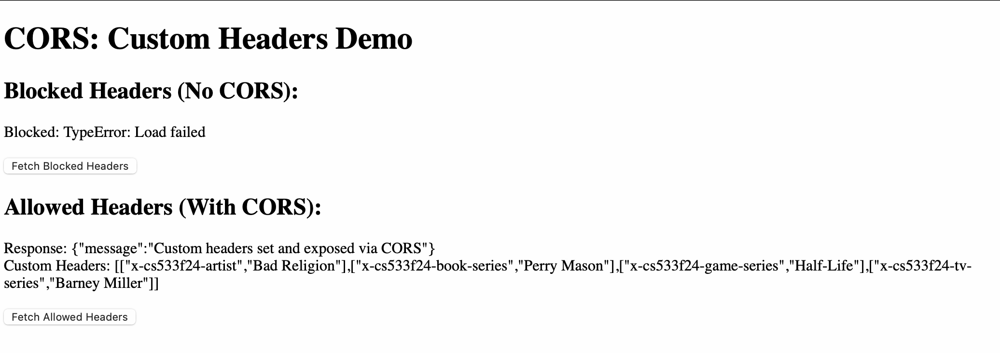

# Assignment 5: Web Security and CSP Demonstrations

This assignment demonstrates three critical concepts of web security using separate exercises hosted locally:
- **5.1**: CORS: Blocking and reading responses from another origin
- **5.2**: CORS: Blocking and reading HTTP response headers from another origin
- **5.3**: Content-Security-Policy: Embedding from another site
---
# Table of Contents

1. [Assignment 5: Web Security and CSP Demonstrations](#assignment-5-web-security-and-csp-demonstrations)
   1. [5.1: CORS: Blocking and reading responses from another origin](#51-cors-blocking-and-reading-responses-from-another-origin)
      - [Files](#files-1)
      - [How It Works](#how-it-works-1)
   2. [5.2: CORS: Blocking and reading HTTP response headers from another origin](#52-cors-blocking-and-reading-http-response-headers-from-another-origin)
      - [Files](#files-2)
      - [How It Works](#how-it-works-2)
   3. [5.3: Content-Security-Policy: Embedding from another site](#53-content-security-policy-embedding-from-another-site)
      - [Files](#files-3)
      - [How It Works](#how-it-works-3)
2. [Links to YouTube Videos](#links-to-youtube-videos)
3. [Screenshots](#screenshots)
   - [5.1: CORS Blocking](#51-cors-blocking)
   - [5.2: Custom Headers](#52-custom-headers)
   - [5.3: CSP Embedding](#53-csp-embedding)
     - [Embedding Allowed](#embedding-allowed)
     - [Embedding Blocked](#embedding-blocked)
---

## **5.1: CORS: Blocking and reading responses from another origin**
This exercise demonstrates:
- Blocking requests due to lack of CORS support.
- Allowing requests when CORS is explicitly enabled.

### **Files**
- `alice.js`: Serves the client-side files.
- `bob.js`: Provides two endpoints (`/no-cors` and `/with-cors`).
- `index.html`: Contains buttons to trigger fetch requests.
- `script.js`: Handles the fetch logic and displays results.

### **How It Works**
- Requests to `/no-cors` fail due to the absence of CORS headers.
- Requests to `/with-cors` succeed because the server includes CORS headers.
---

## **5.2: CORS: Blocking and reading HTTP response headers from another origin**
This exercise shows:
- How custom HTTP headers are set by the server.
- How headers are blocked or allowed based on CORS.

### **Files**
- `alice.js`: Serves the client-side files.
- `bob.js`: Provides `/no-cors-headers` and `/with-cors-headers` endpoints.
- `index.html` & `script.js`: Similar to 5.1 but fetches and displays custom headers.

### **How It Works**
- `/no-cors-headers`: Custom headers are not visible due to CORS blocking.
- `/with-cors-headers`: Headers are exposed because of CORS configuration.
---

## **5.3: Content-Security-Policy: Embedding from another site**
This exercise focuses on:
- Allowing or blocking iframe embedding of external content using CSP headers.

### **Files**
- `alice.js`: Configures CSP headers dynamically.
- `allow-embed.html`: Allows embedding of Merriam-Webster.
- `prohibit-embed.html`: Blocks embedding using CSP.

### **How It Works**
- Pages served with a CSP header (`frame-ancestors`) control whether embedding is allowed or blocked.
---

## **Links to YouTube Videos**
1. [CORS Demonstration (5.1)](https://youtu.be/iUX5NCgCknM)
2. [Custom Headers Demonstration (5.2)](https://youtu.be/0nfrttrXJFY)
3. [CSP Demonstration (5.3)](https://youtu.be/lnuWI8CvjgM)
4. [Optional GitHub Pages (5.4)](#)

---

## **Screenshots**
### **5.1: CORS Blocking**

### **5.2: Custom Headers**

### **5.3: CSP Embedding**
- **Embedding Allowed**:
  
- **Embedding Blocked**:
  
---
