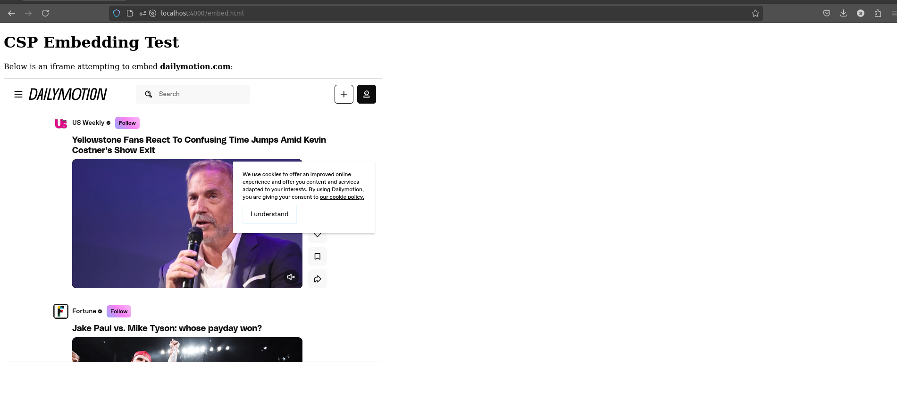

# Assignment 5 Submission: Web Security

## Directories

- **5.1** - Demonstrates blocking and allowing cross-origin JSON responses using CORS.
- **5.2** - Demonstrates blocking and allowing custom HTTP response headers using CORS.
- **5.3** - Demonstrates embedding a remote site using Content Security Policy (CSP).
- **5.4** - (Optional) Hosts results from 5.1, 5.2, and 5.3 on GitHub Pages for extra credit.


---

## **5.1: Blocking and Reading JSON Responses**

### Overview:
This section demonstrates how cross-origin JSON responses are blocked by default and how CORS can be configured to allow access.

### Setup:
- **Server 1** (`server1.js`):
  - Serves the `/favorites` JSON endpoint containing information about my four favorite things.
  - Initially blocks cross-origin requests by disabling CORS.
- **Server 2** (`server2.js`):
  - Serves `index.html` which attempts to fetch JSON data from Server 1.


## Testing Steps

### CORS Disabled (Blocking Cross-Origin Requests)

#### Start Server 1 with CORS Disabled
```bash
export ENABLE_CORS=false
node server1.js
```
---

```bash
node server2.js
```
#### CORS Enabled (Allowing Cross-Origin Requests)
Start Server 1 with CORS Enabled
```bash
export ENABLE_CORS=true
node server1.js
```
##### Refresh index.html from Server 2

    Navigate again to http://localhost:3000 or refresh the page.
    The browser successfully fetches and displays the JSON data from http://localhost:4000/favorites.

### Results:
- **Blocked Request**:
  - Without enabling CORS, cross-origin requests to `/favorites` are blocked by the browser.
  - **Screenshot**: [Blocked JSON Response](#).

- **Allowed Request**:
  - After enabling CORS, cross-origin requests are allowed, and the JSON response is accessible.
  - **Screenshot**: [Allowed JSON Response](#).

---

## **5.2: Blocking and Reading HTTP Response Headers**

### Overview:
This section demonstrates how custom HTTP response headers can be blocked or allowed using CORS.

### Setup:
- **Server 1** (`server1.js`):
  - Adds custom headers (`X-CS533f24-Music`, `X-CS533f24-Movie`, etc.) to the `/favorites` response.
  - Initially does not expose these headers via CORS.
- **Server 2** (`server2.js`):
  - Serves `index.html` which attempts to fetch `/favorites` and log the headers.

### Results:
- **Blocked Headers**:
  - Without exposing the custom headers, the browser blocks access to them.
  - **Screenshot**: [Blocked Custom Headers](#).

- **Allowed Headers**:
  - After adding `exposedHeaders` to the CORS configuration, the custom headers are accessible.
  - **Screenshot**: [Allowed Custom Headers](#).

---

## **5.3: Embedding from Another Site**

### Overview:
This section demonstrates how the Content Security Policy (CSP) can allow or block embedding of a remote site.

### Setup:
- **Server** (`server.js`):
  - Hosts an HTML page (`embed.html`) containing an `<iframe>` that embeds a remote site.
  - Uses CSP headers to:
    - **Allow embedding**: `Content-Security-Policy: frame-ancestors 'self' https://example.com`.
    - **Block embedding**: `Content-Security-Policy: frame-ancestors 'none'`.

### Results:
- **Allowed Embedding**:
  - The remote site is successfully embedded when CSP allows it.
  - **Screenshot**: [Allowed Embedding](#).
  

- **Blocked Embedding**:
  - The remote site is blocked when CSP prohibits it.
  - **Screenshot**: [Blocked Embedding](#).

---

## **5.4: Extra Credit - Hosting on GitHub Pages**

### Overview:
This section hosts the results of 5.1, 5.2, and 5.3 on GitHub Pages.

### Setup:
- **GitHub Pages**:
  - The files for 5.1, 5.2, and 5.3 are uploaded to GitHub Pages.
  - Fetch requests in the HTML files are updated to use the GitHub Pages URLs.

### Results:
- **Screenshots**:
  - Blocked and allowed requests using GitHub-hosted files.

---

## Video Links:

- **5.1**: [Blocking and Reading JSON Responses](https://youtu.be/lRWsf96g44A)
- **5.2**: [Blocking and Reading Custom Headers](https://youtu.be/0pjyg5RI_jg)
- **5.3**: [Embedding with CSP](https://youtu.be/2Ex0jFq0L9c)
- **5.4**: [GitHub Pages Hosted Results (Extra Credit)](#)

---

## Summary:

This assignment demonstrates how to configure and test web security features like CORS and CSP to control cross-origin resource sharing and embedding. Each directory contains code, testing results, and explanations to show how requests and responses behave under different security configurations.


---

Author: Samuel Flores
Date: 2024-11-18