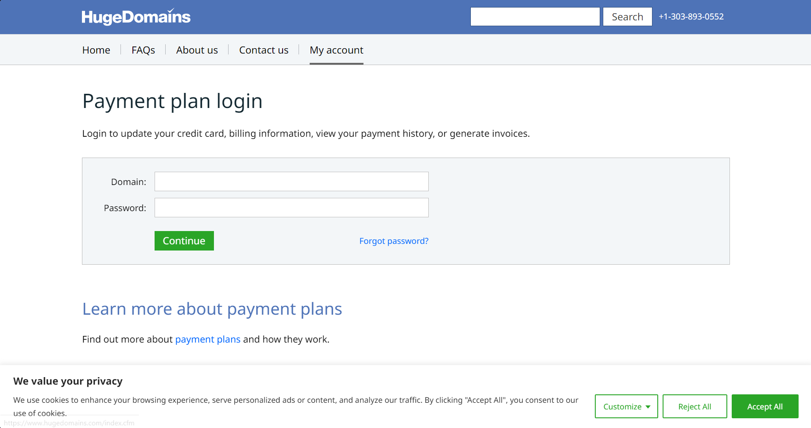

The url that is used by this assignment is localhost:4000

Inorder to run the webserver you need node, express, and body-parser,  installed on your computer. Use 'node Server.js' to start the webserver

# 7

This assignments displays a copy of the [hugedomains website](https://www.hugedomains.com/payment-plan-login.cfm) login page and save the inputed login information to Logins.txt

* The video of 6 files and demonstration is available at: [https://youtu.be/oFW3l6iRoiA](https://youtu.be/oFW3l6iRoiA)

# Problems that occured

* dynamically loaded sites like reddit being difficult to recreate properly if I saved the dynamic copy and not the static copy of the html
* setting access="post.php" was not as simple as it seemed and would either go to "post.php" or would not run with the login information. In the end I used a post responce in the server file to save the login information.
* getting the website all the necessary .css and png files required the creation of several new pages to the website. The solution likely could have been more compact but instead I chose a quick and dirty method copy and pasting most the information.
