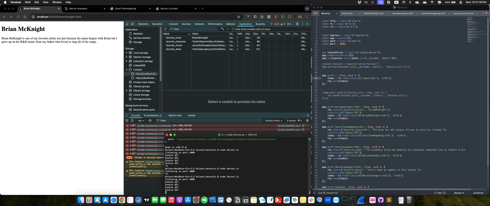
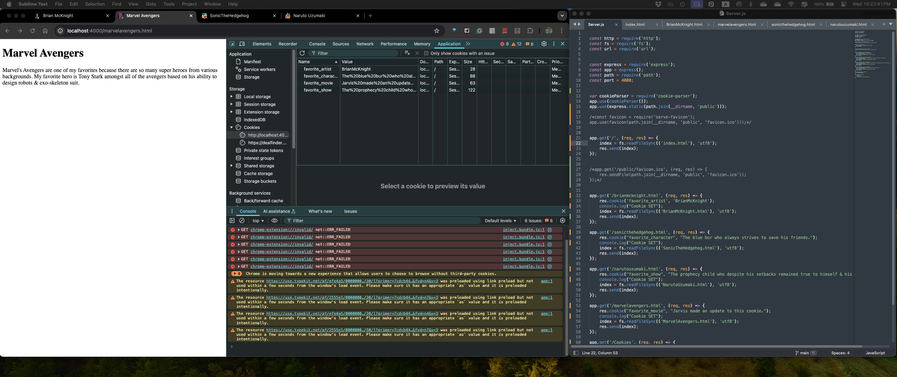
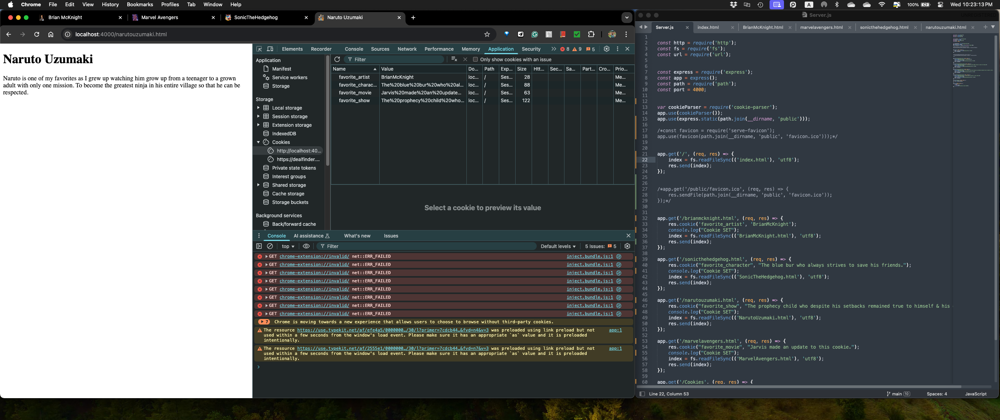
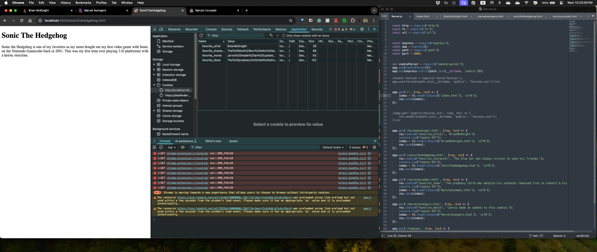

# Assignment 2 CS 533 F24
## Brian Hanson, Jr.

This document lists all of the code developed while completing the setup of a local server with respective favorite arist, tv show, character & movie files using Node.js for both backend & frontend web development.

## To run the Server via Node.js
- node Server.js

## Paths
- /brianmcknight.html
- /marvelavengers.html
- /sonicthehedgehog.html
- /narutouzumaki.html

## Screen Captures of Webpages with Cookies
- **Brian McKnight** 
- **Naruto Uzumaki** 
- **Marvel Avengers** 
- **Sonic The Hedgehog** 

## Setup instructions
1. Installed dependencies: <npm install node.js>, <npm install express>, <npm install cookie-parser>, <npm install serve-favicon>
2. Configured the codebase of the server
3. Started the server: <npm node Server.js>
4. Opened the paths via the web browser

## YouTube Demo Video
- The following is recording of viewing the files, starting the server, & loading each of the 4 paths in my web browser: https://youtu.be/FXA1BpWfZ9s
