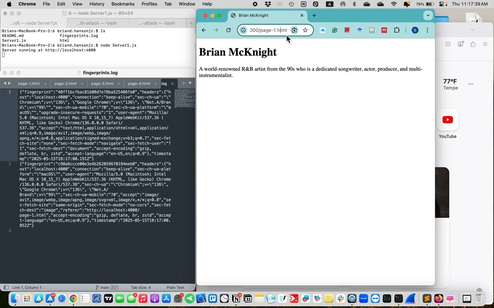
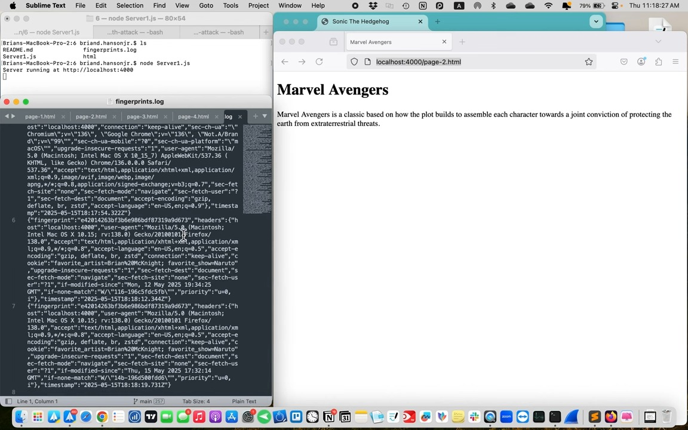
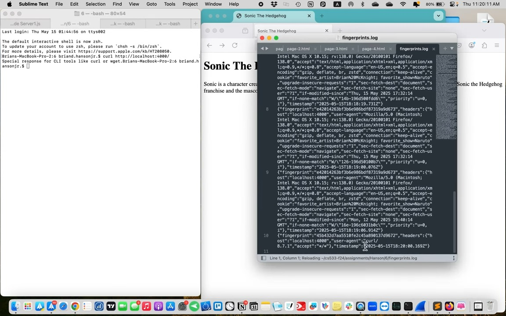

# Assignment 6 CS 533 F24
## Brian Hanson, Jr.


This Node.js Express server project demonstrates browser fingerprinting and cloaking techniques. It identifies and logs returning clients using HTTP headers and delivers personalized content. It also cloaks responses based on IP address and User-Agent.

---

## Features

### Browser Fingerprinting
- Generates MD5-based fingerprints using HTTP headers:
  - `User-Agent`
  - `Accept`
  - `Accept-Language`
  - `Accept-Encoding`
  - `Cookies`
- Logs each fingerprint with headers and a timestamp in `fingerprints.log`.
- Serves consistent, personalized pages to returning clients.

### Cloaking
- Detects command-line tools (`curl`, `wget`) and returns a plain-text message.
- Detects local IPs (`192.168.*.*` and `10.27.*.*`) and serves a special HTML file (`local-user.html`).

---

## Setup

### Requirements
- Node.js installed on your machine.

### Install Dependencies
```bash
npm install
```

### Run the Server
```bash
node server.js
```

Visit: [http://localhost:4000](http://localhost:4000)

---

## File Structure

```
6/
├── Server1.js           # Priamry server logic
├── fingerprints.log     # Fingerprint logs
├── html/                # Fingerprint-based HTML pages
│   ├── page-1.html
│   ├── page-2.html
│   └── ...
└── README.md
```

---

## How Fingerprinting Works

Each client’s headers are hashed into a unique fingerprint using MD5. This ID determines which HTML page (e.g., `page-1.html`) the server serves. Fingerprints are saved in `fingerprints.log` with headers and timestamps.

#### Example Log
```json
{
  "fingerprint": "139a2a7f3ac0d400bbd61e601d68a8a9",
  "headers": {
    "user-agent": "Mozilla/5.0...",
    "accept": "text/html,...",
    ...
  },
  "timestamp": "2025-05-15T02:04:06.329Z"
}
```

---

## Cloaking Behavior

### Command-Line Tools
Returns:
```
Special response for CLI tools like `curl` or `wget`.
```

### Local IPs
Clients with local IPs are served a cloaked page: `local-user.html`.

### Others
Default: serve fingerprint-assigned HTML page.

---

## Personalized Pages
Each unique client gets a `page-#.html` file based on their fingerprint. Pages are sequential (`page-1.html`, `page-2.html`, etc.) and should reflect from their four favorite things from Assignment 2.

---

## Testing Instructions

### 1. Start the Server
```bash
node server.js
```

### 2. Visit with Different Clients
Use at least 6 different clients:
- Desktop: Chrome, Firefox, Safari, Edge
- Mobile: Smartphone, tablet
- CLI: `curl`, `wget`

Each client should receive a unique page determined by their fingerprint.

### 3. View the Log
Check `fingerprints.log` to confirm fingerprinting and logging.

---

## Echo Endpoint

### `/echo`
Returns HTTP request data for testing:
```json
{
  "method": "GET",
  "headers": { ... },
  "client_ip": "::1",
  "time_utc": "2025-05-15T02:15:30.000Z",
  "info": "Echo service from this server"
}
```

---

## Notes

- Ensure `html/` has at least 4 pages based on your favorite things from Assignment 2.
- Use different clients to generate fingerprints and verify persistent identification.
- `fingerprints.log` may contain sensitive data — do not share it publicly.

---

## Screenshots

- **Client 1 (Chrome Desktop)** 
- **Client 2 (Firefox Desktop)** 
- **Client 3 (`curl`)** 
- **Client 4 (Ubuntu VM Opera)** 
- **Client 5 (Macbook Air 2020 Safari)** 
- **Client 6 (iPhone 16 Pro Max Safari)** 

---

## Video Demo

📺 [Assignment 6 Demonstration Video](https://youtu.be/nGOG8Fy2ffA)
