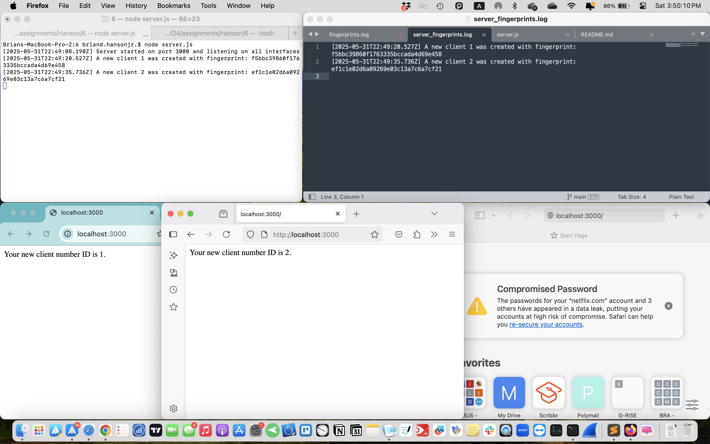

# Assignment 6 CS 533 F24
## Brian Hanson, Jr.

This Node.js Express server demonstrates browser fingerprinting by writing fingerprints to a server-side log. The server can recognize when the same user-agent revists the server by identifying the combined 8 HTTP headers. For different clients, Firefox, Chrome, Safari on a Macbook were served by the server. Then, Chrome & Safari on an iPhone using the MacBook's local IP address. `curl` was the final user-agent to access the server for which all browswers are personalized based on their client number.

---

## Features

### Browser Fingerprinting
- Generates MD5-based fingerprints using HTTP headers:
  - `IP`
  - `User-Agent`
  - `Accept`
  - `Accept-Language`
  - `Accept-Encoding`
  - `Connection`
  - `Host`
  - `Referer`
- Logs each fingerprint with headers and a timestamp in `fingerprints.log`.

---

## Setup

### Requirements
- Node.js installed on your machine.

### Install Dependencies
```bash
npm install
```

### Run the Server
```bash
node server.js
```

Visit: [http://localhost:4000](http://localhost:4000)

---

## File Structure

```
6/
├── server.js                   # Priamry server logic
├── server_fingerprints.log     # Fingerprint logs
└── README.md
```

---

## How Fingerprinting Works

Each client’s headers are hashed into a unique fingerprint using MD5. This ID is associated with a specific client that the server serves. Fingerprints are saved in `server_fingerprints.log` with headers and timestamps.

#### Example Log
```

[2025-05-31T19:51:30.242Z] New client 1 with fingerprint: c8c0ba87b2279093a3477aa088021bc1
[2025-05-31T19:51:30.299Z] New client 2 with fingerprint: 143a499f11888e257cf1834f5269d1a1
[2025-05-31T19:51:43.056Z] New client 3 with fingerprint: fe03109f6377daf1f6fc87f8974d434b
[2025-05-31T19:51:44.354Z] New client 4 with fingerprint: 51144ab5a01d8a038847183a8a67afdb
[2025-05-31T19:51:55.353Z] New client 5 with fingerprint: 708bd1ffcca442f2914ceaac7f33a53b
[2025-05-31T19:51:55.670Z] New client 6 with fingerprint: d6d1edf69db1cdf5aed976f416f320b2

```

---

## Testing Instructions

### 1. Start the Server
```bash
node server.js
```

### 2. Visit with Different Clients
Use at least 6 different clients:
- MacBook: Chrome, Firefox, Safari
- iPhone (using MacBook's local IP address): Chrome, Safari
> - Obtained the MacBook's local IP address `(192.168.86.227:3000)` by:
    ```
    ipconfig getifaddr en0
    ```

- CLI: `curl`

Each client will receive a unique client ID number determined by their fingerprint.

### 3. View the Log
Check `server_fingerprints.log` to confirm fingerprinting and logging.


---

## Screenshots

- **Client 1 (Chrome MacBook)** 
- **Client 2 (Firefox MacBook)** 
- **Client 3 (Safari MacBook)** 
- **Client 4 (Chrome iPhone 13 Pro Max)** 
- **Client 5 (Safari iPhone 13 Pro Max)** 
- **Client 6 (`curl`)** 

---

## Video Demo

[Assignment 6 Demonstration Video](https://youtu.be/x6V44fN97Vc)
