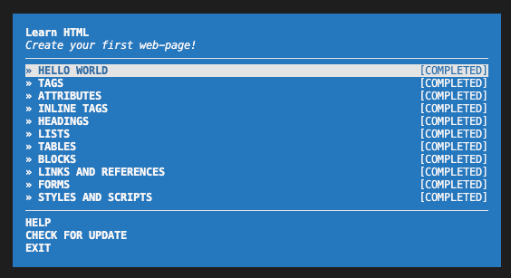
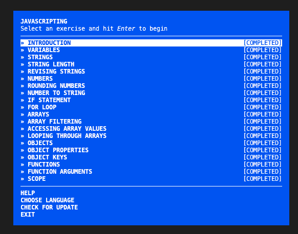
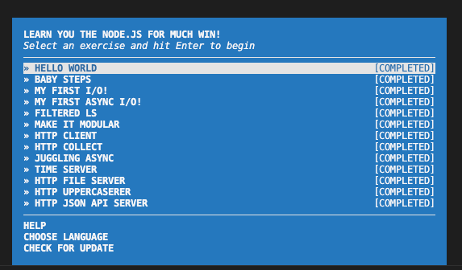

## Assignment 1, CS 433/533 Web Security, Fall 2024 
### Anton Rasmussen

For this assignment we completed three workshops on the following topics:
- html 
- javascript
- node

We installed the content of these workshops via the `npm install -g learnyouhtml javascripting learnyounode` command.

After completing these workshops we have the following directory structure:

```
.
├── README.md
├── html
│   ├── attributes.html
│   ├── blocks.html
│   ├── forms.html
│   ├── headings.html
│   ├── images
│   │   ├── fotor-ai-anton.jpg
│   │   ├── googleg_24dp.png
│   │   └── learnyouhtml_screenshot.png
│   ├── index.html
│   ├── inline_tags.html
│   ├── javascript.js
│   ├── links_and_references.html
│   ├── lists.html
│   ├── style.css
│   ├── styles_and_scripts.html
│   ├── tables.html
│   └── tags.html
├── javascript
│   ├── images
│   │   └── javascripting_screenshot.png
│   └── javascripting
│       ├── accessing-array-values.js
│       ├── array-filtering.js
│       ├── arrays.js
│       ├── for-loop.js
│       ├── function-arguments.js
│       ├── functions.js
│       ├── if-statement.js
│       ├── introduction.js
│       ├── looping-through-arrays.js
│       ├── number-to-string.js
│       ├── numbers.js
│       ├── object-keys.js
│       ├── object-properties.js
│       ├── objects.js
│       ├── revising-strings.js
│       ├── rounding-numbers.js
│       ├── scope.js
│       ├── string-length.js
│       ├── strings.js
│       └── variables.js
└── node
    ├── baby-steps.js
    ├── filtered-ls.js
    ├── hello-world.js
    ├── http-client.js
    ├── http-collect.js
    ├── http-file-server.js
    ├── http-json-api-server.js
    ├── http-uppercaserer.js
    ├── images
    │   └── node_screenshot.png
    ├── juggling-async.js
    ├── make-it-modular.js
    ├── my-first-async-io.js
    ├── my-first-io.js
    ├── mymodule.js
    └── time-server.js
```
After completing each workshop I took a screen shot showingcompletion of each exercise:





The video of the files and test completion pages is available at: [https://youtu.be/i1cYvm1NWJk](https://youtu.be/i1cYvm1NWJk)
