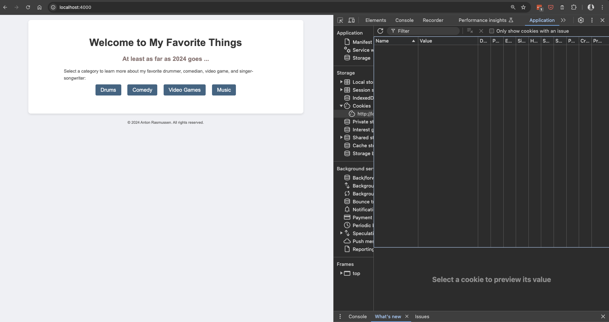
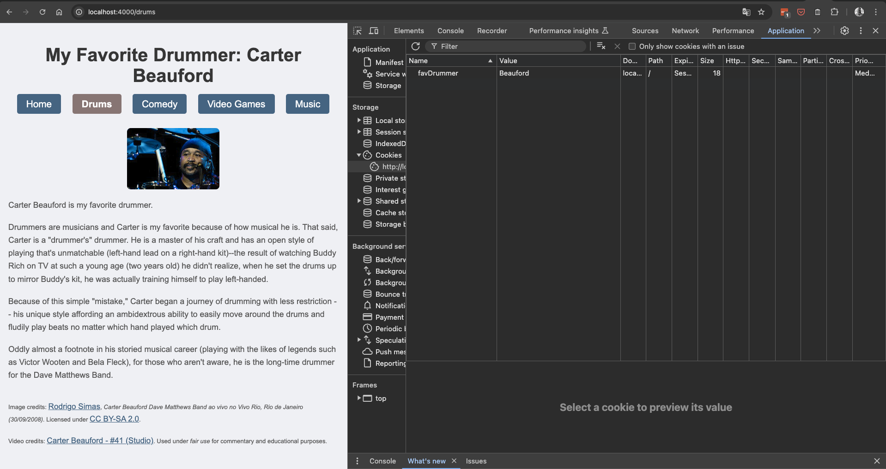
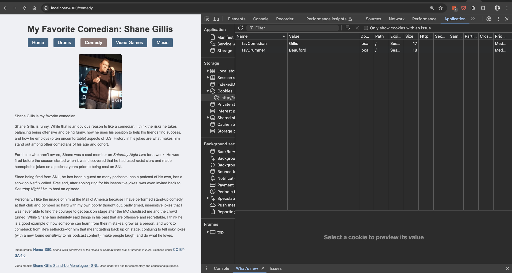
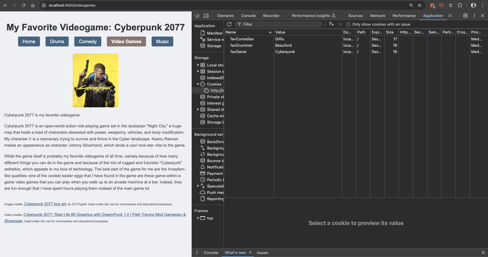
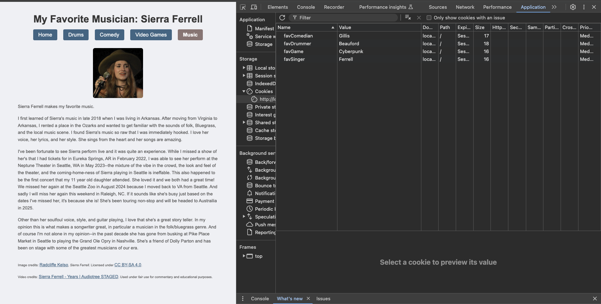

## Assignment 2, CS 433/533 Web Security, Fall 2024 
### Anton Rasmussen

For this assignment, we developed a website using a web server to serve four distinct endpoints, each of which sets a unique cookie. Each endpoint links to an HTML page that provides details on some of our favorite things.

In order to create our webserver we installed `node.js`, installed and imported any libraries necessary to run our website (e.g. `npm install express` ), and wrote the code necessary to display our web content as well as set distinct cookies for each endpoint's HTTP response.

After completing this website we have the following directory structure:

```
.
├── README.md
├── images
│   ├── Carter_Screenshot.png
│   ├── Cyberpunk_Screenshot.png
│   ├── Index_Screenshot.png
│   ├── Shane_Screenshot.png
│   └── Sierra_Screenshot.png
├── package-lock.json
├── package.json
├── public
│   ├── comedy.html
│   ├── drums.html
│   ├── images
│   │   ├── Carter_Beauford.jpg
│   │   ├── Cyberpunk_2077.jpg
│   │   ├── Shane_Gillis.jpg
│   │   ├── Sierra_Ferrell.jpg
│   │   └── mj_favicon.png
│   ├── index.html
│   ├── music.html
│   ├── scripts
│   │   └── modal.js
│   ├── styles
│   │   ├── styles.css
│   │   └── video_styles.css
│   └── videogames.html
└── server.js

6 directories, 22 files

```
Note: I ran `tree -I 'node_modules'` to ignore the verbose `node_modules` directory; notably this directory is hidden (i.e. configured to be ignored by git).

After completing each page I took a screen shot showing both the page and the cookie being set on that page:


<p class="center-text"><small><em>Index Page (no cookie set)</em></small></p>

<p><small><em>Favorite Drummer (cookie set-> favDrummer=Beauford)</em></small></p>

<p><small><em>Favorite Comedian (cookie set-> favCommedian=Gillis)</em></small></p>

<p><small><em>Favorite Video Game (cookie set-> favGame=Cyberpunk)</em></small></p>

<p><small><em>Favorite Musician (cookie set-> favSinger=Ferrell)</em></small></p>

The video of me demonstrating the website is available at: [https://youtu.be/nJmFVZ9MW-A](https://www.youtube.com/watch?v=nJmFVZ9MW-A).

<em>Note: Make sure to set the Quality to 1080p60<sup>HD</sup></em>

Oh, one last thing... I did try and snag the Extra Credit by including a favicon! 