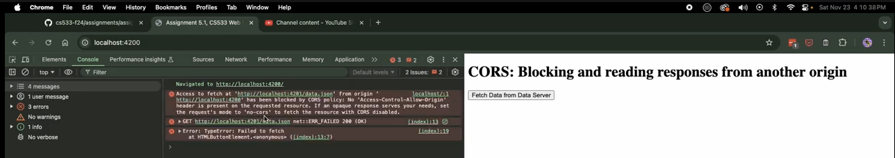
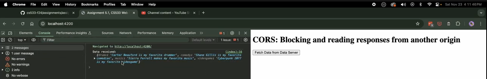
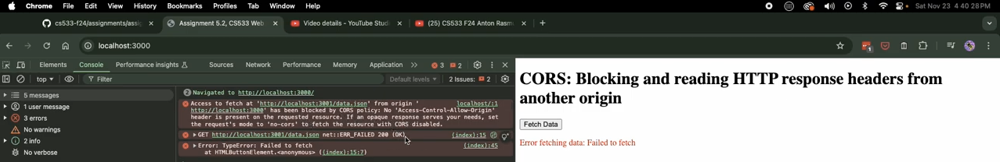
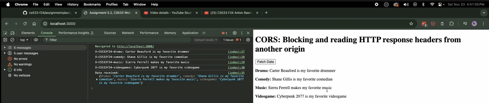
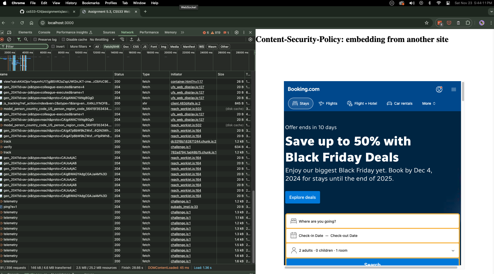
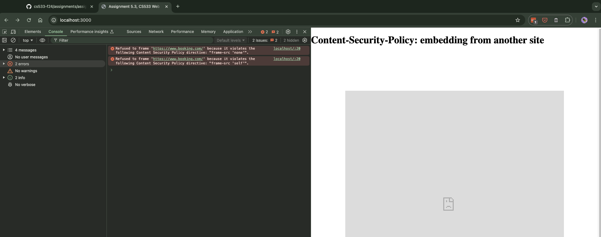

## Assignment 5, CS 433/533 Web Security, Fall 2024

### Anton Rasmussen

Points available: 15

For this assignment, we set up two different node servers, running simultaneously on two different ports.

```
├── 5.1
│   ├── client_server.js
│   ├── data.json
│   ├── data_server.js
│   └── index.html
├── 5.2
│   ├── client_server.js
│   ├── data.json
│   ├── data_server_allowed.js
│   ├── data_server_blocked.js
│   └── index.html
├── 5.3
│   ├── client_server.js
│   └── index.html
└── README.md
```

### CORS: Blocking and reading responses from another origin (5 points)
```
├── 5.1
│   ├── client_server.js
│   ├── data.json
│   ├── data_server.js
│   └── index.html
```
* In the ```5.1``` directory we created:
    - A Node.js client server (`client_server.js`) serving an `index.html` file.
    - A `data.json` file containing data related to my favorite things from assignment 2.
    - A Node.js data server (`data_server.js`) serving a json file (`data.json`).
    - An `index.html` file containing JavaScript that requests a JSON response from another origin.

* These files help to demonstrate Javascript running in one HTML file requesting a .json response from another origin. 
    - Using commented code we can show how the json response from one server is blocked, and what is necessary to allow the response.

* The following video demonstrates `5.1`: https://youtu.be/XKaOi9FhVvQ

*The following image shows the CORS error:*


*The following image shows a successful request:*



### CORS: Blocking and reading HTTP response headers from another origin (5 points)
```
├── 5.2
│   ├── client_server.js
│   ├── data.json
│   ├── data_server_allowed.js
│   ├── data_server_blocked.js
│   └── index.html

```

* In the ```5.2``` directory we created:
    - A Node.js client server (`client_server.js`) serving an `index.html` file.
    - A `data.json` file containing data related to my favorite things from assignment 2.
    - A Node.js data server (`data_server_allowed.js`) allowing to serve a json file (`data.json`).
    - A Node.js data server (`data_server_blocked.js`) blocking the serving of a json file (`data.json`).
    - An `index.html` file containing JavaScript that requests a JSON response from another origin.

* These files help to demonstrate how four custom HTTP response headers (```X-CS533f24-*```, where ```*``` corresponds to my four favorite things from assignment 2) are both blocked and then allowed by one server.  
    - Using two different data-servers we can show how the json response from one server is blocked, and what is necessary to allow the responses.

* The following video demonstrates `5.2`: https://youtu.be/HmZAZDQC5Qo

*The following image shows the CORS error:*


*The following image shows a successful response:*



### Content-Security-Policy: embedding from another site (5 points)
```
├── 5.3
│   ├── client_server.js
│   └── index.html
```

* In the ```5.3``` directory we created:
    - A Node.js client server (`client_server.js`) serving an `index.html` file.
    - An `index.html` file that contains an iFrame with an embedded remote site.

* These files help to demonstrate how a local HTML file is being allowed to embed a remote site from assignment 4 that allowed embedding (`booking.com`) . 
    - Additionaly, using commented code, we can show how a local server can be configured to prohibit embedding.

* The following video demonstrates `5.3`: https://youtu.be/STz9mxmJ_x8

*The following image shows the successfully embedded site (`booking.com`):*


*The following image shows the Content-Security-Policy errors for both `"frame-src 'none'"` and `"frame-src 'self'"`:*

