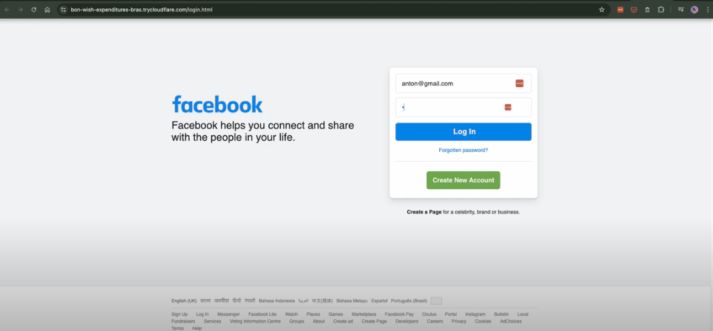

## Assignment 7, CS 433/533 Web Security, Fall 2024

### Anton Rasmussen

Due: 2024-12-13

Points available: 15

For this assignment, I constructed a phishing site that collects login information.

### A Simple Phishing Site

Using one of my 100 web sites that offers logging in from previous assignments (`arxiv.org`)'s login site: `https://arxiv.org/login`, I modified the HTML (specifically where the Login button redirects) and serve it from my own node server on my machine to create a convincing phishing site. I made sure all the images, Javascript, CSS, etc. were all loaded from my local resources. When the login button is pushed, I send the login information to my local node server and record it in a log file (`log.txt`) and the site redirects to itself making it look like there was some kind of error and the user needs to log in again.

I demonstrate the operation of the phishing site in this Youtube video: https://youtu.be/M-TUNj1Jdc8
<br>

### Below are screenshots showing Assignment 7:

 
*Image 7.1: Submit Endpoint for Phishing*
<br>
 
*Image 7.2: Replaced Submit Path*
<br>
 
*Image 7.3: Legitimate arXiv.org Login Site*
<br>
 
*Image 7.4: Phishing arXiv.org Login Site*
<br>
 
*Image 7.5: Phishing arXiv.org Login Site With Diff Login*
<br>
 
*Image 7.4: Phishing Log*
<br>
<br>


### Extra credit

Using Zphisher I demonstrated the creation of three phishing sites: Facebook, Proton Mail, and Deviant Art.

I demonstrate the operation of Zphisher and the creation of the three sites in this Youtube video: https://youtu.be/9pdHwe4yn64

### Below are screenshots showing Assignment 7 Extra Credit:

 
*Image EC.1: Facebook Phishing Site*
<br>
 
*Image EC.2: What Zphisher Captured from Facebook*
<br>
 
*Image EC.3: Proton Mail Phishing Site*
<br>
 
*Image EC.4: What Zphisher Captured from Proton*
<br>
 
*Image EC.5: Deviant Art Phishing Site*
<br>
 
*Image EC.6: What Zphisher Captured from Deviant Art*
<br>
 
*Image EC.7: usernames.dat from Zphisher*

<br>
<br>

### Directory "7"

All of the code, files, images, etc. necessary to complete this assignment are in directory `7` and have the following directory structure:

```
.
├── README.md
├── log.txt
├── package-lock.json
├── package.json
├── phishing
│   └── arXiv
│       ├── arxiv-logo-one-color-white.svg
│       ├── arxivstyle.css
│       ├── cornell-reduced-white-SMALL.svg
│       └── index.html
├── photos
│   ├── Assignment_7_1.png
│   ├── Assignment_7_2.png
│   ├── Assignment_7_3.png
│   ├── Assignment_7_4.png
│   ├── Assignment_7_5.png
│   ├── Assignment_7_6.png
│   ├── Extra_Credit_1.png
│   ├── Extra_Credit_2.png
│   ├── Extra_Credit_3.png
│   ├── Extra_Credit_4.png
│   ├── Extra_Credit_5.png
│   ├── Extra_Credit_6.png
│   └── Extra_Credit_7.png
└── server.js
```
